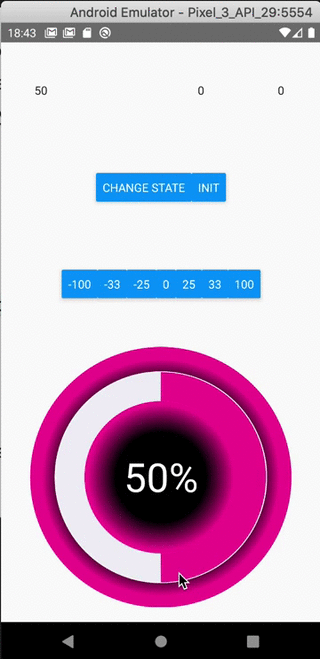

# react-native-knob
A simple and fully customizable React Native component that implements circular progress bar.

It uses react-native-reanimated to get 60fps animation. and react-native-gesture-handler for the gestures.

[NPM package](https://www.npmjs.com/package/react-native-knob)

## Works on both iPhone and Android
| Iphone | Android |
| :---:  |  :---:  |
|  |  |

## Installation
If using yarn :

```
yarn add react-native-knob
```

If using npm :

```
npm i react-native-knob
```

### Additional installation steps
Don´t forget to install pods if they are not installed yet
#### For ios from your root app folder run :
```
cd ios && pod install
```
#### For android :
You will need to add those lines in your java files if not already done on your project.
It concerns the react-native-gesture-handler package see [documentation here](https://software-mansion.github.io/react-native-gesture-handler/docs/getting-started.html#android) 

## Usage
See Example app for testing.

```
import React, { useState } from 'react';
import { StyleSheet, View, TextInput, Button, Text, Dimensions } from 'react-native';

import { Knob } from 'react-native-knob';

export default App = () => {
  const [val1, setVal1] = useState(0);
  const [knobValue, setKnobValue] = useState(0);
  const { width, height } = Dimensions.get("window");
  const [isLandscape, setIsLandscape] = useState(height < width);
  let buttons = [-100, -33, -25, 0, 25, 33, 100];

  callback = (values) => {
    setKnobValue(values[0]);
  }

  updateKnobValue = (value) => {
    _knobRef.setValue(value === 0 ? value : knobValue + value);
  }

  onLayout = () => {
    console.log("layautChangeApp");
    const { width, height } = Dimensions.get("window");
    setIsLandscape(height < width);
  }

  const styles = StyleSheet.create({
    container: {
      flex: 1,
      flexDirection: isLandscape ? 'row' : 'column',
      alignItems: 'center',
    },
    labels: {
      flex: 1,
      flexDirection: isLandscape ? 'column' : 'row',
      justifyContent: 'center',
    },
    label: {
      flex: 1,
      textAlign: 'center',
    },
    buttons: {
      flex: 1,
      flexDirection: isLandscape ? 'column' : 'row',
      justifyContent: 'center',
      alignItems: 'center',
    },
    button: {
      padding: 10,
      marginHorizontal: 50,
      backgroundColor: '#E03997',
      color: 'white',
    },
  });

  return (
    <View style={styles.container} onLayout={this.onLayout}>
      <View style={styles.labels}>
        <TextInput
          value={knobValue.toString()}
          style={styles.label}
          ref={component => _textInput1 = component}
        />
        <TextInput
          style={styles.label}
          ref={component => _textInput2 = component}
        />
        <TextInput
          value={val1.toString()}
          style={styles.label}
        />
      </View>
      <View style={styles.buttons}>
        <Button
          style={styles.button}
          title="Change State"
          onPress={() => setVal1(val1 + 1)}
        />
      </View>
      <View style={styles.buttons}>
        {buttons.map((val, i) => <Button
          key={i}
          style={styles.button}
          title={val.toString()}
          onPress={() => updateKnobValue(val)}
        />)}
      </View>
      <Knob
        ref={component => _knobRef = component}
        margin={0}
        padding={32}
        strokeWidth={80}
        value={knobValue}
        maxValue={100}
        rotation={0}
        negative={true}
        colors={['#F0EFF5', '#E03997', '#6435C9', '#A5673F', '#AAA', '#888', '#666', '#444', '#222', '#000']}
        gradientInt={[{ offset: '50%', stopColor: '#000' }, { offset: '80%', stopColor: '#E03997' }]}
        gradientExt={[{ offset: '100%', stopColor: '#E03997' }, { offset: '80%', stopColor: '#000' }]}
        textStyle={{ color: '#E03997' }}
        {...{ callback }}
        style={{ flex: 2 }}
      />
    </View>
  );
};
```

## Controlled component
You can set the Knob´s value imperatively using a ref on the Knob component and calling the _knobRef.setValue(value : number) on it. (See example above)

If you change the state of the parent´s knob component, it will not rerender the knob. So you can´t control the value of the knob with a parent variable state.

## Responsive
The component will resize automatically to take all the space available by his container in landscape mode or not.

## Documentation

### Knob Component
| Name                      | Description                              | Type        | Default |
|---------------------------|------------------------------------------|-------------|--------|
| margin | Space between edge of canvas and knob (included the knob´s decoration internal gradient) | number | 0
| padding | Space between gradientInt and knob | number | 0
| strokeWidth | Explicit | number | 90
| strokeWidthDecoration | The circle under the progress one | number | 30
| value | Explicit | number | 25
| maxValue | You can set any number value that you want. The knob will adapt and provide a percent value anyway | number | 100
| rotation | Begin position where the knob start. Value unit is in Radians. 0 is position to the right like in trigonometric circle. Under the hood, it´s a style transform using here. | number | -Math.PI / 2
| negative | If your want the knob can be negative and goes inverted | boolean | true
| colors | The colors of each loop. The first color is for decoration knob. | Array<string> | ['#F0EFF5', '#00b5ad', '#2185D0', '#B5CC18', '#FBBD08', '#F2711C', '#DB2828', '#E03997', '#6435C9', '#A5673F', '#AAA', '#888', '#666', '#444', '#222', '#000']
| gradientInt | If you want to decorate your knob with an internal radial gradient  | Array<StopGradient> | [{ offset: '50%', stopColor: '#000' }, { offset: '80%', stopColor: '#fff' }]
| gradientExt | If you want to decorate your knob with an external radial gradient  | Array<StopGradient> | [{ offset: '100%', stopColor: '#fff' }, { offset: '90%', stopColor: '#000' }]
| textStyle | You can customize the text inside | object | { color: 'white', textAlign: 'center', fontSize: canvasSize / 8 }
| textDisplay | If you don´t want the text in the middle | boolean | true
| style | Change style of the knob main container | object | true
| callback | This function will be called each time the knob´s value change. First param is an array and first value is the value of the knob | (values: readonly number[]) => void | callback: () => { }
| canvasSize | Fix the size of the canvas |  number | undefined

## Contributing
Pull requests are always welcome! Feel free to open a new GitHub issue for any changes that can be made.

## Author
Réan Guillaume

If you want to eat better and healthy, i recommand to check out my mobile app [dietethic](https://dietethic.net) this component was created to allow daily better food recording.

## License
[MIT](./LICENSE)

## Special Thanks
Thanks to William Candillon and his youtube chanel | [can it be done in React Native ?](https://www.youtube.com/user/wcandill)