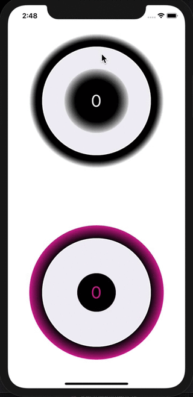

# react-native-knob
A simple and fully customizable React Native component that implements circular progress bar.

It uses react-native-reanimated to get 60fps animation. and react-native-gesture-handler for the gestures.

[NPM package](https://www.npmjs.com/package/react-native-knob)

## Works on both iPhone and Android
| Iphone | Android |
| :---:  |  :---:  |
|  |  |

## Installation
If using yarn :

```
yarn add react-native-knob
```

If using npm :

```
npm i react-native-knob
```

### Additional installation steps
Don´t forget to install pods if they are not installed yet
#### For ios from your root app folder run :
```
cd ios && pod install
```
#### For android :
You will need to add those lines in your java files if not already done on your project.
It concerns the react-native-gesture-handler package see [documentation here](https://software-mansion.github.io/react-native-gesture-handler/docs/getting-started.html#android) 

## Usage

```
import { Knob } from 'react-native-knob';
```

See Example app for testing.

```
const App = () => {
  return (
    <View style={styles.container}>
      <View style={styles.knob}>
        <Knob
          negative={false}
          margin={100}
          padding={64}
          strokeWidth={50}
          gradientInt={[{ offset: '50%', stopColor: '#000' }, { offset: '80%', stopColor: '#fff' }]}
          gradientExt={[{ offset: '100%', stopColor: '#fff' }, { offset: '90%', stopColor: '#000' }]}
        />
        {/* gradientInt={[{ offset: '50%', stopColor: '#000' }, { offset: '80%', stopColor: '#fff' }]} */}
      </View>
      <View style={styles.knob}>
        <Knob
          margin={100}
          padding={64}
          strokeWidth={80}
          value={0}
          maxValue={1000}
          rotation={0}
          negative={true}
          colors={['#F0EFF5', '#E03997', '#6435C9', '#A5673F', '#AAA', '#888', '#666', '#444', '#222', '#000']}
          gradientInt={[{ offset: '50%', stopColor: '#000' }, { offset: '80%', stopColor: '#E03997' }]}
          gradientExt={[{ offset: '100%', stopColor: '#E03997' }, { offset: '80%', stopColor: '#000' }]}
          textStyle={{ color: '#E03997' }}
        />
      </View>
    </View>
  );
};

const styles = StyleSheet.create({
  container: {
    flex: 1,
    flexDirection: 'column',
    alignItems: 'center',
  },
  knob: {
    flex: 1,
    justifyContent: 'center',
  },
});
```

## Documentation

### Knob Component
| Name                      | Description                              | Type        | Default |
|---------------------------|------------------------------------------|-------------|--------|
| margin | space between edge of canvas and knob (included the knob´s decoration internal gradient) | number | 0
| padding | space between gradientInt and knob | number | 0
| strokeWidth | explicit | number | 90
| strokeWidthDecoration | the circle under the progress one | number | 30
| value | explicit | number | 25
| maxValue | You can set any number value that you want. The knob will adapt and provide a percent value anyway | number | 100
| rotation | Begin position where the knob start. Value unit is in Radians. 0 is position to the right like in trigonometric circle. Under the hood, it´s a style transform using here. | number | -Math.PI / 2
| negative | If your want the knob can be negative and goes inverted | boolean | true
| colors | The colors of each loop. The first color is for decoration knob. | Array<string> | ['#F0EFF5', '#00b5ad', '#2185D0', '#B5CC18', '#FBBD08', '#F2711C', '#DB2828', '#E03997', '#6435C9', '#A5673F', '#AAA', '#888', '#666', '#444', '#222', '#000']
| gradientInt | If you want to decorate your knob with an internal radial gradient  | Array<StopGradient> | [{ offset: '50%', stopColor: '#000' }, { offset: '80%', stopColor: '#fff' }]
| gradientExt | If you want to decorate your knob with an external radial gradient  | Array<StopGradient> | [{ offset: '100%', stopColor: '#fff' }, { offset: '90%', stopColor: '#000' }]
| textStyle | You can customize the text inside | object | { color: 'white', textAlign: 'center', fontSize: canvasSize / 8 }
| textDisplay | If you don´t want the text in the middle | boolean | true

## Contributing
Pull requests are always welcome! Feel free to open a new GitHub issue for any changes that can be made.

## Author
Réan Guillaume

If you want to eat better and healthy, i recommand to check out my mobile app [dietethic](https://dietethic.net) this component was created to allow daily better food recording.

## License
[MIT](./LICENSE)

## Special Thanks
Thanks to William Candillon and his youtube chanel | [can it be done in React Native ?](https://www.youtube.com/user/wcandill)